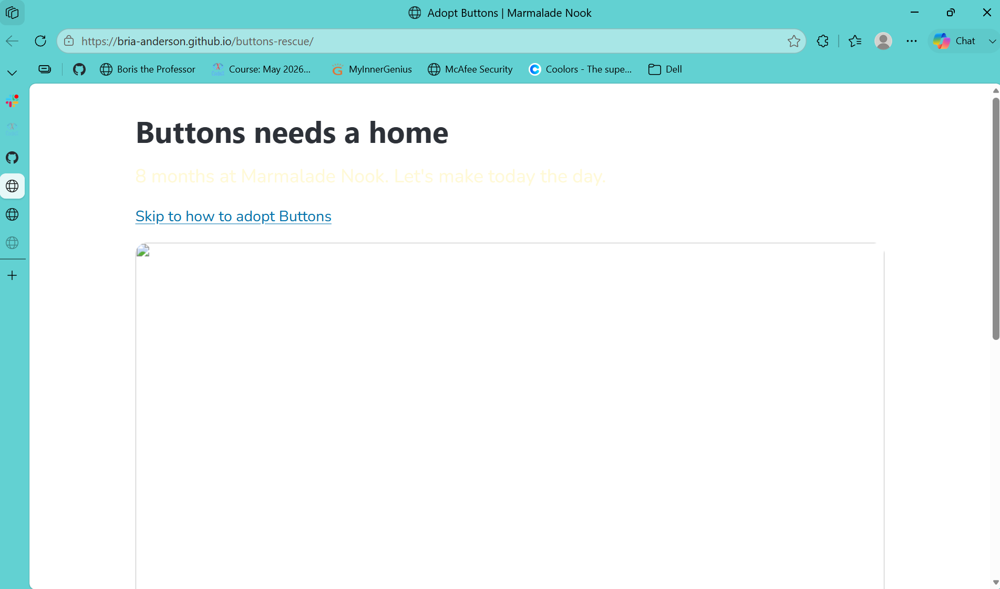
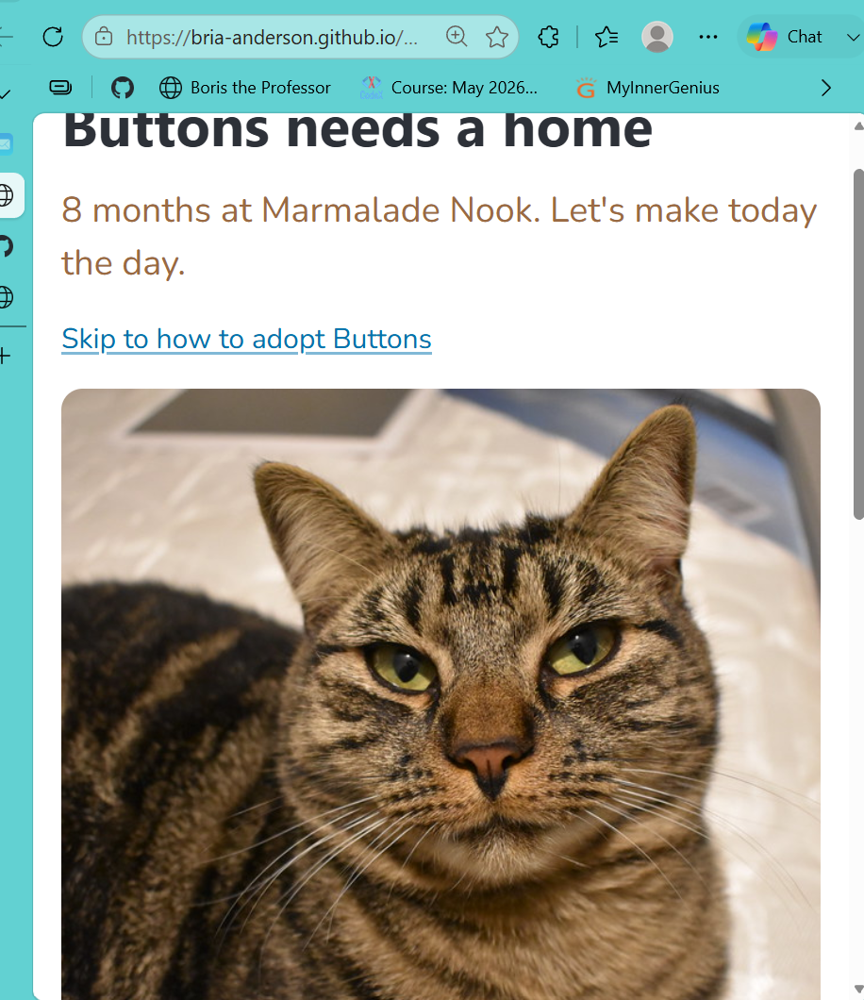

# Buttons' Rescue

Marmalade Nook, a small animal shelter, created an adoption webpage for Buttons. Buttons is a brown tabby cat at the animal shelter who needs a home with a sense of urgency. The web page created by Marmalade Nook had many issues between the index.html and style.css. Due to the issues, the webpage was broken. In result, Button's has been waiting 8 months too long for a home.

## Before and after 

# What I fixed

- Button's photo doesn't show.
- Text following "Buttons has waited longer than any cat here" is bold.
- "Skip to how to adopt Buttons" link broken and doesn't move view to bottom of page.
- "His story" is plain and should be inside a colored box.
- The urgent long-stay note doesn't use text that demonstrates urgency.
- Tagline beneath Button's name is illegible.
- The blank photo space doesn't express what the missing photo should.
- Button's story is missing.

## Credits

Photo: "cat" by Burnt Pineapple Productions, CC0 1.0

Live page: https://Bria-Anderson.hithub.io/buttons-rescue/